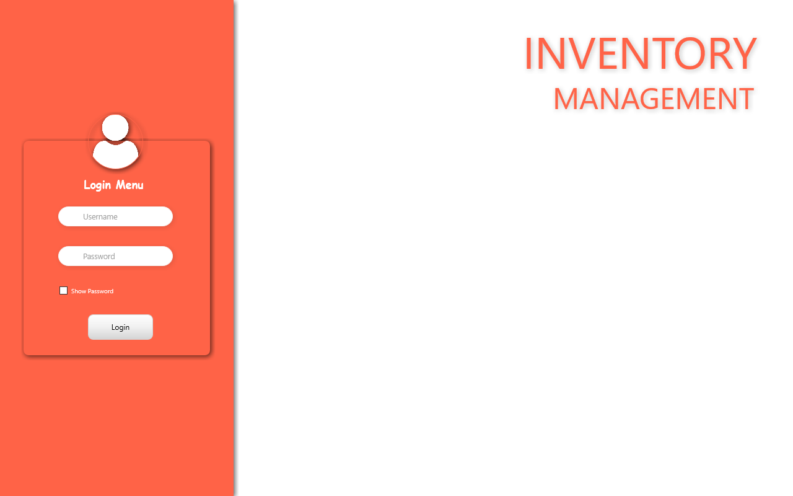
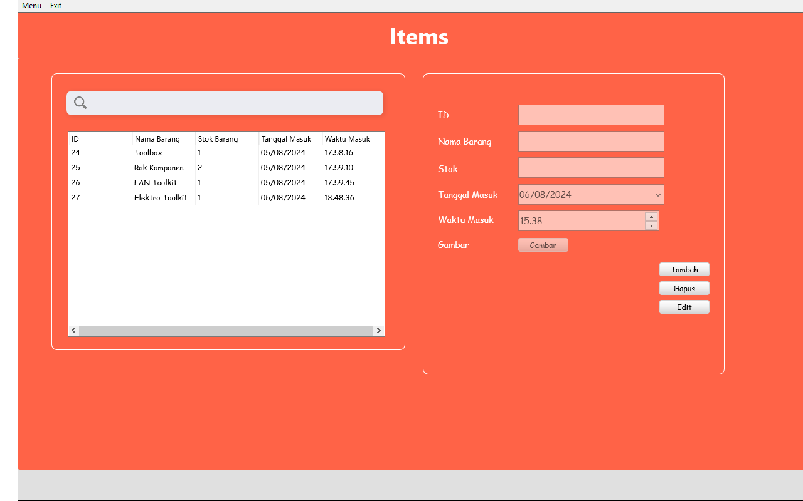

# Inventory-Management-System




## Gambaran Umum

Aplikasi Manajemen Inventaris adalah solusi sederhana dan efisien yang dirancang untuk membantu Anda mengelola dan melacak barang inventaris. Aplikasi ini menawarkan antarmuka yang ramah pengguna dan fitur penting seperti menambah, mengedit, menghapus barang, serta mencari barang dalam inventaris Anda. Aplikasi ini dikembangkan menggunakan Delphi 11 dan menggunakan SQLite sebagai database-nya.

## Fitur

- **Dashboard**: Menampilkan ringkasan informasi kunci dan metrik inventaris.
- **Manajemen Barang**:
  - **Tambah**: Tambahkan barang inventaris baru dengan detail seperti nama, stok, tanggal, waktu, dan gambar.
  - **Edit**: Edit barang yang sudah ada untuk memperbarui perubahan dalam inventaris.
  - **Hapus**: Hapus barang dari inventaris.
  - **Cari**: Gunakan kotak pencarian untuk menemukan detail inventaris dengan cepat.
- **Manajemen Pengguna**:
  - Lihat informasi pengguna yang tersimpan dalam database.

## Prasyarat

Sebelum menjalankan aplikasi, pastikan Anda sudah menginstal:

- Delphi 11 (atau versi yang kompatibel)
- Library SQLite
- FMX (FireMonkey) framework

## Instalasi

1. **Kloning Repository**:
   ```bash
   git clone https://github.com/fajarjulyana/Inventory-Management-System.git
   ```

2. **Buka Proyek**:
   - Buka Delphi 11.
   - Arahkan ke folder repository yang telah diklon dan buka file `InventoryManagementApp.dproj`.

3. **Konfigurasi Database**:
   - Pastikan database SQLite Anda telah disiapkan dan dikonfigurasi dengan benar.
   - Perbarui pengaturan koneksi di unit `uDM.pas` jika diperlukan.

4. **Kompilasi dan Jalankan**:
   - Kompilasi proyek dengan mengklik tombol **Run** di Delphi.
   - Pastikan library dan dependensi yang diperlukan sudah terpasang dengan benar di opsi proyek Anda.

## Penggunaan

### Menu Utama

- **Dashboard**: Akses halaman ringkasan untuk mendapatkan gambaran cepat tentang status inventaris Anda.
- **Items**: Mengelola barang inventaris.
  - **Tambah**: Klik "Tambah" untuk menambah barang baru. Isi detailnya dan simpan.
  - **Edit**: Pilih barang dari grid, klik "Edit" untuk mengubah, dan simpan perubahan.
  - **Hapus**: Pilih barang dan klik "Hapus" untuk menghapusnya dari inventaris.
- **Pengaturan**: Sesuaikan pengaturan aplikasi sesuai kebutuhan Anda.

### Fungsi Pencarian

- Masukkan kata kunci pencarian di kotak pencarian di bagian atas aplikasi.
- Aplikasi akan secara dinamis memfilter dan menampilkan hasil berdasarkan kata kunci yang dimasukkan.

## Struktur Kode

- **uMenu.pas**: Berisi form utama dan logika untuk menangani event dan interaksi UI.
- **uDM.pas**: Unit Modul Data untuk koneksi database dan penanganan query.
- **Komponen Form**: Termasuk komponen seperti `TStringGrid`, `TEdit`, `TImage`, dan elemen UI lainnya.

### Metode Kunci

- **EnableEditor/DisableEditor**: Mengaktifkan atau menonaktifkan kontrol pengeditan pada form.
- **RefreshGrid**: Memperbarui grid inventaris untuk menampilkan data terbaru dari database.
- **ExecuteSQL**: Menjalankan query SQL dan menangani interaksi database.
- **SearchAndDisplayResults**: Fungsi pencarian untuk memfilter data grid.
- **LoadImageToImageControl**: Memuat dan menampilkan gambar dari sistem file.

## Berkontribusi

Kami menyambut kontribusi untuk meningkatkan Aplikasi Manajemen Inventaris ini. Untuk berkontribusi:

1. Fork repository ini.
2. Buat branch fitur: `git checkout -b feature/nama-fitur-anda`.
3. Commit perubahan Anda: `git commit -m 'Tambah fitur baru Anda'`.
4. Push ke branch: `git push origin feature/nama-fitur-anda`.
5. Buat pull request.

## Lisensi

Proyek ini dilisensikan di bawah Lisensi MIT - lihat file [LICENSE](LICENSE) untuk detailnya.

## Kontak

Untuk pertanyaan lebih lanjut atau masalah, silakan hubungi pengelola proyek di [fajarjulyana1@gmail.com](mailto:fajarjulyana1@gmail.com).


### Penjelasan

- **Gambaran Umum**: Memberikan penjelasan singkat mengenai aplikasi dan teknologi yang digunakan.
- **Fitur**: Menjelaskan fitur-fitur utama yang tersedia dalam aplikasi.
- **Prasyarat**: Menyediakan informasi tentang apa yang perlu dipersiapkan sebelum menjalankan aplikasi.
- **Instalasi**: Memberikan panduan langkah demi langkah untuk menginstal dan menjalankan aplikasi.
- **Penggunaan**: Menjelaskan cara menggunakan aplikasi dan memanfaatkan fitur-fiturnya.
- **Struktur Kode**: Menjelaskan struktur dan organisasi kode aplikasi, termasuk unit-unit penting.
- **Berkontribusi**: Menjelaskan bagaimana orang lain dapat berkontribusi pada proyek ini.
- **Lisensi**: Menyediakan informasi tentang lisensi yang digunakan untuk proyek ini.
- **Kontak**: Menyediakan informasi kontak untuk mendapatkan bantuan atau informasi lebih lanjut.
